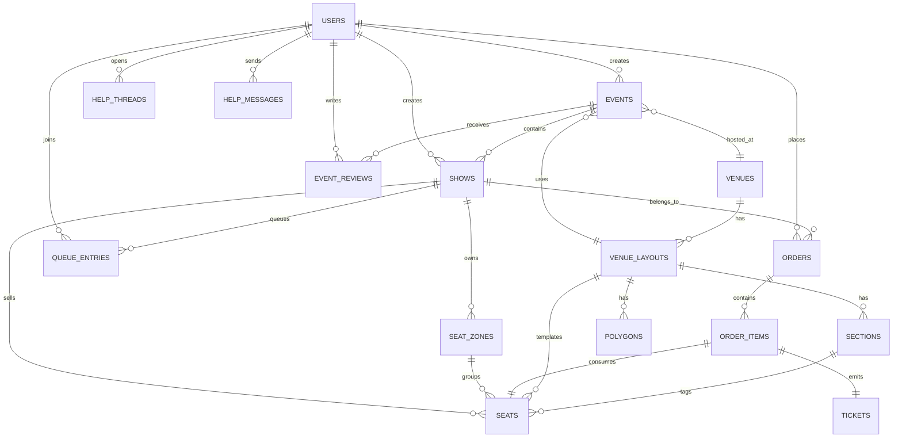

# TicketRush Backend Guide

## 1. Muc tieu cua backend

Backend TicketRush phuc vu 5 nhom nghiep vu chinh:

1. Authentication va profile user
2. Event/show catalog
3. Virtual queue
4. Seat locking, checkout, ticket lifecycle
5. Venue builder, seat map, admin analytics, help desk

Stack hien tai:

- FastAPI
- SQLAlchemy async
- PostgreSQL
- Redis
- Background worker noi bo
- WebSocket cho seat/admin/help

## 2. Entry point va startup pipeline

### 2.1 Entry point

- File: `BE/app/main.py`
- Vai tro:
  - tao `FastAPI app`
  - mount static files
  - add CORS middleware
  - include REST router va WebSocket router
  - khai bao `lifespan`

### 2.2 Lifespan startup lam gi

Trong `lifespan()` cua `main.py`, backend chay theo thu tu sau:

1. Tao schema `ticket_rush` neu chua co
2. Dam bao cot `events.is_deleted`
3. `Base.metadata.create_all`
4. Chay cac ham "ensure" de tu backfill schema cu:
   - `_ensure_cover_image_url_text_column()`
   - `_ensure_seats_admin_lock_column()`
   - `_ensure_template_seat_columns_are_nullable()`
   - `_ensure_user_auth_columns()`
   - `_ensure_show_refactor_schema()`
5. Seed demo data qua `seed_demo_data(session)`
6. Start `worker_orchestrator`

Y nghia:

- Project nay co kha nang tu tuong thich voi database cu ma khong bat buoc nguoi dung phai chay migration thu cong truoc.
- Doi lai, ban phai nho la mot phan migration logic dang nam ngay trong startup.

### 2.3 Shutdown

Khi app tat:

1. stop worker orchestrator
2. dispose SQLAlchemy engine

## 3. So do thu muc backend

### 3.1 Thu muc theo tang kien truc

- `BE/app/main.py`
  - app entrypoint
- `BE/app/api/router.py`
  - ghep tat ca router vao `/api`
- `BE/app/api/routes/`
  - HTTP endpoint layer
- `BE/app/services/`
  - business logic layer
- `BE/app/models/`
  - ORM layer
- `BE/app/schemas/`
  - request/response schema layer
- `BE/app/core/`
  - config, db, security, cache, firebase, redis
- `BE/app/ws/`
  - WebSocket connection management
- `BE/app/workers/`
  - background task orchestration
- `BE/tests/`
  - regression test suite

### 3.2 Cach doc backend theo thu tu dung

Neu ban la nguoi moi, doc backend theo chuoi nay:

1. `app/main.py`
2. `app/api/router.py`
3. `app/api/routes/auth.py`
4. `app/api/routes/events.py`
5. `app/api/routes/queue.py`
6. `app/api/routes/bookings.py`
7. `app/services/event_service.py`
8. `app/services/queue_service.py`
9. `app/services/booking_service.py`
10. `app/models/event.py`
11. `app/models/seat.py`
12. `app/models/order.py`
13. `app/models/venue.py`
14. `tests/test_booking_lifecycle.py`
15. `tests/test_virtual_queue.py`
16. `tests/test_venue_api.py`

Ly do:

- route cho ban biet API surface
- service cho ban biet business rule
- model cho ban biet DB structure
- test cho ban biet contract va expected behavior

## 4. Router map

File tong: `BE/app/api/router.py`

Tat ca REST endpoint deu di qua prefix `/api`.

Router dang duoc include:

- `auth.router`
- `events.event_router`
- `events.show_router`
- `queue.router`
- `bookings.router`
- `admin.router`
- `help.router`
- `search.router`
- `venues.router`
- `layout_router`
- `section_router`
- `seat_router`
- `polygon_router`
- `seatmap.router`
- `seatmap.event_router`

## 5. Tang API, service, model: input va output

### 5.1 Route layer

- File mau:
  - `app/api/routes/events.py`
  - `app/api/routes/bookings.py`
  - `app/api/routes/admin.py`
- Input:
  - path param
  - query param
  - JSON body
  - current user qua dependency
- Xu ly:
  - validate schema
  - authorize
  - goi service
- Output:
  - response schema JSON

### 5.2 Service layer

- File mau:
  - `app/services/event_service.py`
  - `app/services/queue_service.py`
  - `app/services/booking_service.py`
- Input:
  - `AsyncSession`
  - ORM object hoac primitive params
- Xu ly:
  - truy van DB
  - enforce business rule
  - cap nhat state nghiep vu
- Output:
  - ORM object hoac response DTO

### 5.3 Model layer

- File:
  - `app/models/*.py`
- Nhiem vu:
  - khai bao bang, khoa ngoai, relationship, enum status

## 6. Database structure

### 6.1 Bang cot loi

#### `users`

- File: `app/models/user.py`
- Luu:
  - thong tin nguoi dung
  - password hash
  - social login ids
  - role
  - gender
  - age

#### `events`

- File: `app/models/event.py`
- Vai tro:
  - parent container cho mot nhom show
- Luu:
  - `slug`, `title`, `description`, `category`
  - `start_date`, `end_date`
  - `status`, `is_deleted`
  - metadata queue defaults
  - lien ket den `venue` va `venue_layout`

#### `shows`

- File: `app/models/event.py`
- Vai tro:
  - don vi thuc su duoc ban ve
- Luu:
  - thoi gian bat dau/ket thuc cu the
  - venue/show-level queue settings

#### `seat_zones`

- File: `app/models/event.py`
- Vai tro:
  - khai bao khu ban ghe theo gia/mau/so hang/so cot

#### `seats`

- File: `app/models/seat.py`
- Vai tro:
  - tung ghe cu the
- Luu:
  - row, number, label, price
  - `status`
  - `lock_expires_at`
  - `locked_by_user_id`
  - `is_admin_locked`
  - toa do canvas `%`
  - section/layout lien quan

#### `orders`, `order_items`, `tickets`, `ticket_cancellations`

- File: `app/models/order.py`
- Vai tro:
  - don hang, dong hang, ve phat hanh, lich su huy

#### `queue_entries`

- File: `app/models/queue.py`
- Vai tro:
  - waiting room state theo user/show

#### `venues`, `venue_layouts`, `sections`, `polygons`

- File: `app/models/venue.py`
- Vai tro:
  - venue builder va ban do ghe

#### `event_reviews`

- File: `app/models/review.py`
- Vai tro:
  - review event tu customer

#### `help_threads`, `help_messages`

- File: `app/models/help.py`
- Vai tro:
  - tro giup va chat giua customer va admin

### 6.2 ER diagram theo implementation hien tai



### 6.3 Luong du lieu database quan trong nhat

#### A. Event/show creation flow

Input:

- admin id
- `EventCreateRequest`
- co the kem venue/layout

Process:

1. tao record `events`
2. neu event co show ngay tu dau, tao `shows`
3. neu show dung venue layout template, clone seat/polygon metadata can thiet
4. luu quan he vao DB

Output:

- `Event`
- `Show`
- seat inventory ban dau neu co

File trung tam:

- `app/services/event_service.py`

#### B. Queue join flow

Input:

- `show_id`
- `user_id`

Process:

1. check show co bat queue khong
2. tim token active hien tai cua user
3. neu chua co, tao `queue_entries`
4. danh `status = waiting`
5. worker sau do se admit theo batch

Output:

- token
- position
- queue status

File trung tam:

- `app/services/queue_service.py`

#### C. Seat lock flow

Input:

- `show_id`
- `seat_ids`
- `user_id`
- `queue_token`

Process:

1. resolve show
2. verify queue access neu show bat queue
3. `SELECT ... FOR UPDATE`
4. bo qua ghe da sold, da admin lock, hoac lock hop le cua user khac
5. set `status = locked`
6. set `locked_by_user_id`
7. set `lock_expires_at`

Output:

- locked seat ids
- failed seat ids

File:

- `app/services/booking_service.py`

#### D. Checkout flow

Input:

- `show_id`
- `user_id`
- `queue_token`

Process:

1. resolve show
2. xac nhan user dang so huu cac ghe `locked`
3. tao `orders`
4. tao `order_items`
5. tao `tickets`
6. doi `seat.status` thanh `sold`
7. mark queue completed

Output:

- `CheckoutResponse`
- danh sach ticket code va QR payload

#### E. Ticket cancel flow

Input:

- `ticket_id`
- `user_id`

Process:

1. tim ticket cua user
2. tao `ticket_cancellations`
3. doi trang thai ghe ve `available`
4. dat lai lock fields
5. luu lich su phuc vu analytics/admin

Output:

- API message
- ticket van co the xuat hien trong history o trang thai `cancelled`

## 7. API catalog

### 7.1 Auth

File: `app/api/routes/auth.py`

- `POST /api/auth/register`
- `POST /api/auth/login`
- `POST /api/auth/firebase-token`
- `GET /api/auth/me`
- `PATCH /api/auth/me`

### 7.2 Public event/show

File: `app/api/routes/events.py`

- `GET /api/events`
- `GET /api/events/{event_key}`
- `GET /api/shows/{show_id}`
- `GET /api/events/{event_key}/reviews`
- `POST /api/events/{event_key}/reviews`

### 7.3 Queue

File: `app/api/routes/queue.py`

- `POST /api/shows/{show_id}/queue/join`
- `GET /api/shows/{show_id}/queue/status/{token}`
- `POST /api/shows/{show_id}/queue/heartbeat/{token}`

### 7.4 Booking

File: `app/api/routes/bookings.py`

- `POST /api/bookings/lock`
- `POST /api/bookings/release`
- `POST /api/bookings/checkout`
- `GET /api/bookings/my-tickets`
- `DELETE /api/bookings/my-tickets/{ticket_id}`

### 7.5 Seat map

File: `app/api/routes/seatmap.py`

- `GET /api/shows/{show_id}/seats`
- `GET /api/shows/{show_id}/seatmap`
- `GET /api/events/{event_key}/seatmap`
- `GET /api/shows/{show_id}/sections`

Ghi chu:

- `GET /api/events/{event_key}/seatmap` la compatibility endpoint, no resolve primary show cua event.

### 7.6 Admin event/show/inventory

File: `app/api/routes/admin.py`

Nhom endpoint lon:

- event CRUD
- show CRUD
- show stats
- zone CRUD
- seat create/update/delete
- upload event image
- users list
- ticket sales
- revenue by show
- dashboard summary/revenue/audience/occupancy

Ghi chu quan trong:

- Co them cac endpoint compatibility cho event-level seat operations:
  - `POST /api/admin/events/{event_key}/seats/single`
  - `POST /api/admin/events/{event_key}/seats/bulk`
  - `PATCH /api/admin/events/{event_key}/seats/{seat_id}`

### 7.7 Venue builder

File: `app/api/routes/venues.py`

Nhom endpoint:

- venue CRUD
- upload/process SVG/background
- layout CRUD
- section CRUD
- template seat CRUD
- polygon CRUD

Day la mot cum route rieng, dung de tao "ban mau venue" truoc khi clone sang show inventory.

### 7.8 Help desk

File: `app/api/routes/help.py`

- customer tao thread cua minh
- customer xem/gui message
- admin list thread
- admin xem/gui message

### 7.9 Search

File: `app/api/routes/search.py`

- `GET /api/search/suggest`

## 8. WebSocket va background worker

### 8.1 WebSocket

File: `app/api/routes/ws.py`

Co 3 kenh chinh:

- seat ws theo show
- admin dashboard ws
- help chat ws theo thread

Muc dich:

- dong bo trang thai nhanh hon polling
- ho tro chat va dashboard

### 8.2 Background worker

File: `app/workers/tasks.py`

Orchestrator chay cac job nen:

- process virtual queue
- cleanup expired queue entries
- release expired seat locks

Neu muon debug van de "queue khong nhuc nhich" hoac "ghe bi lock mai khong mo", day la noi can doc truoc.

## 9. Schema migration strategy hien tai

Project khong chi dua vao Alembic. No dang co mo hinh lai:

1. Alembic folder ton tai
2. Mot phan schema safety migration duoc nhung vao `main.py`

Dieu nay giup project de chay demo, nhung khi dua len production nghiem tuc, nen chuyen dan logic backfill nay ve migration script ro rang.

## 10. Test suite

### 10.1 Test files

- `tests/test_booking_lifecycle.py`
  - lock, checkout, cancel ticket
- `tests/test_virtual_queue.py`
  - waiting room, heartbeat, expiry, release
- `tests/test_map_processor.py`
  - SVG seat extraction va coordinate normalize
- `tests/test_admin_seats.py`
  - admin seat operations
- `tests/test_venue_api.py`
  - venue/layout/seat/polygon APIs

### 10.2 Conftest

- File: `tests/conftest.py`
- Vai tro:
  - tao database test in-memory
  - override dependency
  - tao sample payload/object

### 10.3 Cach doc test de hieu business rule

Neu chua tin source code, test la hop dong dung nhat.

Doc theo thu tu:

1. `test_booking_lifecycle.py`
2. `test_virtual_queue.py`
3. `test_venue_api.py`

Vi 3 file nay bao phu phan nghiep vu lon nhat cua project.

## 11. Run, check, verify

### 11.1 Local BE

```bash
cd BE
../.venv/bin/python -m pytest -q
```

### 11.2 Docker compose

```bash
docker compose up --build -d
curl http://localhost:8000/health
docker compose exec -T backend python -m pytest -q
docker compose down
```

Ghi chu:

- Trong moi truong container cua project nay, `python -m pytest` dang on dinh hon goi binary `pytest` truc tiep.

## 12. Mapping use case -> file can doc

### 12.1 Muon sua dang ky/dang nhap

1. `app/api/routes/auth.py`
2. `app/core/security.py`
3. `app/models/user.py`

### 12.2 Muon sua event list va detail

1. `app/api/routes/events.py`
2. `app/services/event_service.py`
3. `app/models/event.py`

### 12.3 Muon sua queue

1. `app/api/routes/queue.py`
2. `app/services/queue_service.py`
3. `app/workers/tasks.py`
4. `app/models/queue.py`

### 12.4 Muon sua dat ve/thanh toan

1. `app/api/routes/bookings.py`
2. `app/services/booking_service.py`
3. `app/models/seat.py`
4. `app/models/order.py`

### 12.5 Muon sua venue builder

1. `app/api/routes/venues.py`
2. `app/services/map_processor.py`
3. `app/models/venue.py`
4. `app/models/seat.py`

### 12.6 Muon sua admin seat planner

1. `app/api/routes/admin.py`
2. `app/services/event_service.py`
3. `app/services/inventory_service.py`
4. `app/models/event.py`
5. `app/models/seat.py`

## 13. Doi chieu voi anh trong assets

Project implementation hien tai khong khop 100% voi cac so do trong `assets/`.

Ly do chi tiet:

1. So do `assets/...15-27-21.png` mo ta context level:
   - customer
   - admin
   - external payment system
   - event/ticket/payment information flow
   Day la muc tong quan, nen kha gan voi project, nhung van thieu queue, help desk, review, venue builder, websocket.

2. So do `assets/...15-27-42.png` mo ta DFD muc chi tiet hon:
   - co process "quan ly nguoi dung", "quan ly su kien", "quan ly buoi dien", "quan ly ve-cho", "xu ly dat ve", "xu ly thanh toan", "thong ke"
   Backend hien tai khop tuong doi ve chuc nang, nhung ten bang/process va granularity khong trung 1-1.

3. So do `assets/...15-27-54.png` mo ta ERD theo domain cu:
   - co `NGHE_SI`
   - co bang trung gian `SHOW_ARTIST`
   - co `THONG TIN THANH TOAN`
   - co `USER_EVENT`
   - co `CAC BO TRI`
   Implementation hien tai KHONG co cac model nay trong DB.

Noi cach khac:

- muc nghiep vu tong quat: gan dung
- muc ERD chi tiet: khong khop 100%

## 14. Ket luan

Muoi phan muon hieu backend, hay nho mot chuoi co dinh:

`HTTP Route -> Dependency/Auth -> Service -> ORM Query/Transaction -> Response Schema`

Con neu la nghiep vu dat ve, chuoi day du hon la:

`Event -> Show -> Queue -> Seat Lock -> Checkout -> Ticket -> Cancellation/Analytics`

Neu ban trace duoc chuoi nay trong source, ban da nam duoc phan lon backend cua project.
